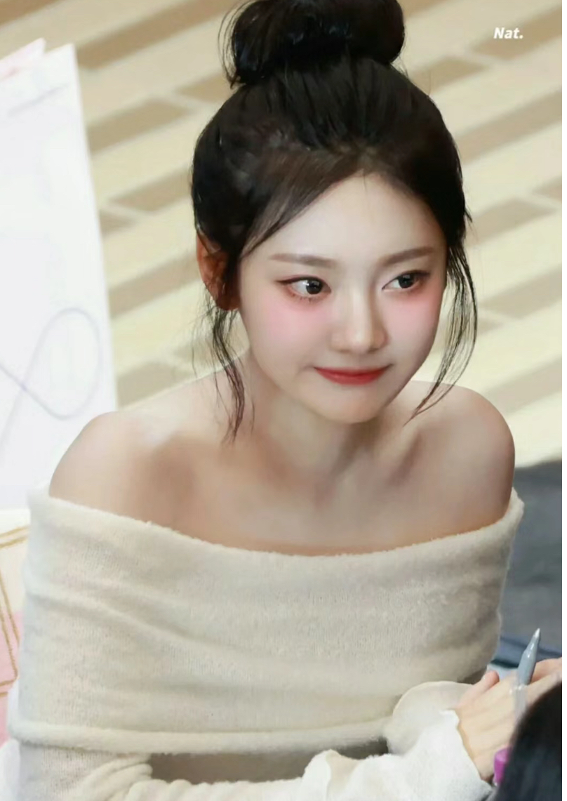

# Assignment 1 - Image Warping

assignment：

name : RuiGUO
student id: PB21151758
ddl:2024/10/1


## Implementation of Image Geometric Transformation
以下为待处理的图片：



## Requirements

To install requirements:

```setup
python -m pip install -r requirements.txt
```


## Running

To run basic transformation, run:

```basic
python run_global_transform.py
```

To run point guided transformation, run:

```point
python run_point_transform.py
```

## Results

### Original picture


### Basic Transformation

操作演示视频链接如下：
global展示视频
链接: https://pan.baidu.com/s/13t_USlVS73fbOrCJXuzFsw 提取码: 1dip 


### Point Guided Deformation:

操作演示视频链接如下：
通过网盘分享的文件：point展示视频
链接: https://pan.baidu.com/s/1P1sB4gVpAV548nTOwtp8OA?pwd=1dip 提取码: 1dip 


## Acknowledgement

>📋 Thanks for the algorithms proposed by [Image Deformation Using Moving Least Squares](https://people.engr.tamu.edu/schaefer/research/mls.pdf).
